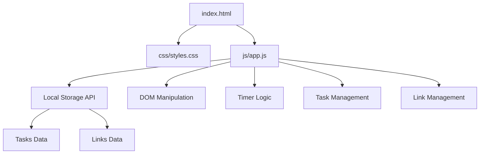
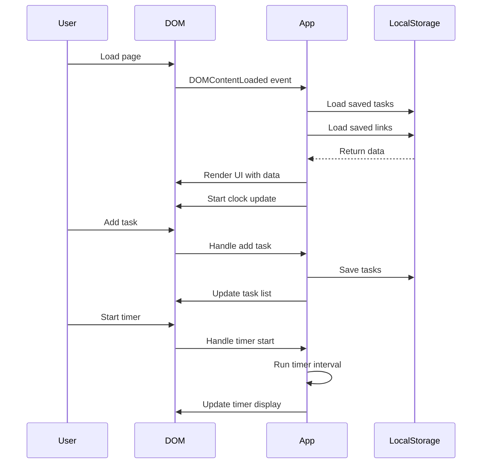

# Design Document: Productivity Dashboard

## Overview

A lightweight, client-side productivity dashboard web app that combines essential productivity tools: a greeting with time/date display, a 25-minute focus timer, a to-do list, and quick links to favorite websites. Built with vanilla HTML, CSS, and JavaScript, all data persists in browser Local Storage with no backend required. The app features a clean, minimal interface optimized for fast load times and responsive interactions.

## Architecture



## Main Application Workflow



## Components and Interfaces

### Component 1: Greeting Module

**Purpose**: Display current time, date, and contextual greeting

**Interface**:
```javascript
class GreetingModule {
  constructor(containerElement)
  updateClock()
  getGreeting()
  render()
}
```

**Responsibilities**:
- Update time display every second
- Calculate appropriate greeting based on hour (Morning: 5-11, Afternoon: 12-17, Evening: 18-21, Night: 22-4)
- Format date and time for display

### Component 2: Focus Timer

**Purpose**: Pomodoro-style 25-minute countdown timer

**Interface**:
```javascript
class FocusTimer {
  constructor(containerElement)
  start()
  stop()
  reset()
  tick()
  formatTime(seconds)
  render()
}
```

**Responsibilities**:
- Manage timer state (running, paused, stopped)
- Count down from 25 minutes (1500 seconds)
- Update display every second
- Handle start/stop/reset actions
- Format time as MM:SS

### Component 3: To-Do List Manager

**Purpose**: CRUD operations for task management with persistence

**Interface**:
```javascript
class TodoList {
  constructor(containerElement)
  loadTasks()
  saveTasks()
  addTask(text)
  editTask(id, newText)
  toggleTask(id)
  deleteTask(id)
  render()
}
```

**Responsibilities**:
- Load tasks from Local Storage on init
- Save tasks to Local Storage on every change
- Generate unique IDs for tasks
- Manage task state (text, completed status)
- Render task list with edit/delete/toggle controls

### Component 4: Quick Links Manager

**Purpose**: Manage and display favorite website shortcuts

**Interface**:
```javascript
class QuickLinks {
  constructor(containerElement)
  loadLinks()
  saveLinks()
  addLink(name, url)
  deleteLink(id)
  render()
}
```

**Responsibilities**:
- Load links from Local Storage on init
- Save links to Local Storage on every change
- Validate URLs
- Open links in new tabs
- Render link buttons with delete controls

## Data Models

### Task Model

```javascript
interface Task {
  id: string           // Unique identifier (timestamp-based)
  text: string         // Task description
  completed: boolean   // Completion status
  createdAt: number    // Timestamp
}
```

**Validation Rules**:
- `id` must be unique and non-empty
- `text` must be non-empty string (max 200 characters)
- `completed` must be boolean
- `createdAt` must be valid timestamp

### Link Model

```javascript
interface Link {
  id: string      // Unique identifier (timestamp-based)
  name: string    // Display name
  url: string     // Valid URL
}
```

**Validation Rules**:
- `id` must be unique and non-empty
- `name` must be non-empty string (max 50 characters)
- `url` must be valid URL format (http:// or https://)

### Timer State

```javascript
interface TimerState {
  timeRemaining: number    // Seconds remaining
  isRunning: boolean       // Timer active status
  intervalId: number | null // setInterval reference
}
```

## Key Functions with Formal Specifications

### Function 1: saveTasks()

```javascript
function saveTasks(tasks)
```

**Preconditions:**
- `tasks` is an array of valid Task objects
- Each task has required properties: id, text, completed, createdAt
- Local Storage is available in browser

**Postconditions:**
- Tasks array is serialized to JSON
- Data is stored in Local Storage under key 'productivity-tasks'
- Returns true on success, false on failure
- No mutations to input array

**Loop Invariants:** N/A

### Function 2: loadTasks()

```javascript
function loadTasks()
```

**Preconditions:**
- Local Storage is available in browser

**Postconditions:**
- Returns array of Task objects from Local Storage
- If no data exists, returns empty array
- If data is corrupted, returns empty array and logs error
- No side effects on Local Storage

**Loop Invariants:** N/A

### Function 3: addTask()

```javascript
function addTask(text)
```

**Preconditions:**
- `text` is non-empty string
- `text` length is between 1 and 200 characters
- Tasks array is initialized

**Postconditions:**
- New Task object created with unique ID
- Task added to tasks array
- Tasks saved to Local Storage
- UI updated to show new task
- Input field cleared

**Loop Invariants:** N/A

### Function 4: toggleTask()

```javascript
function toggleTask(id)
```

**Preconditions:**
- `id` is valid task identifier
- Task with given ID exists in tasks array

**Postconditions:**
- Task's completed status is inverted
- Tasks saved to Local Storage
- UI updated to reflect new status
- Task order unchanged

**Loop Invariants:** N/A

### Function 5: startTimer()

```javascript
function startTimer()
```

**Preconditions:**
- Timer is not already running
- timeRemaining is greater than 0

**Postconditions:**
- Timer state set to running
- Interval created that calls tick() every 1000ms
- intervalId stored for later cleanup
- Start button disabled, stop button enabled

**Loop Invariants:** N/A

### Function 6: tick()

```javascript
function tick()
```

**Preconditions:**
- Timer is in running state
- intervalId is valid

**Postconditions:**
- timeRemaining decremented by 1
- Display updated with new time
- If timeRemaining reaches 0: timer stops, alert shown
- Timer state remains consistent

**Loop Invariants:**
- For each tick: timeRemaining >= 0
- Display always shows formatted version of timeRemaining

## Algorithmic Pseudocode

### Main Initialization Algorithm

```javascript
// Main initialization on page load
function initializeApp() {
  // Precondition: DOM is fully loaded
  // Postcondition: All modules initialized and rendered
  
  const greetingContainer = document.getElementById('greeting-section');
  const timerContainer = document.getElementById('timer-section');
  const todoContainer = document.getElementById('todo-section');
  const linksContainer = document.getElementById('links-section');
  
  // Initialize modules
  const greeting = new GreetingModule(greetingContainer);
  const timer = new FocusTimer(timerContainer);
  const todoList = new TodoList(todoContainer);
  const quickLinks = new QuickLinks(linksContainer);
  
  // Start clock updates
  greeting.updateClock();
  setInterval(() => greeting.updateClock(), 1000);
  
  // Render all components
  greeting.render();
  timer.render();
  todoList.render();
  quickLinks.render();
}

// Wait for DOM to be ready
document.addEventListener('DOMContentLoaded', initializeApp);
```

**Preconditions:**
- HTML document contains required container elements
- Browser supports ES6 features
- Local Storage API is available

**Postconditions:**
- All modules are instantiated
- Data loaded from Local Storage
- UI rendered with current state
- Clock update interval running

### Timer Tick Algorithm

```javascript
function tick() {
  // Precondition: Timer is running, timeRemaining > 0
  // Postcondition: Time decremented, display updated, or timer stopped
  
  if (!this.isRunning) {
    return; // Guard clause
  }
  
  this.timeRemaining--;
  
  // Update display
  const display = this.container.querySelector('.timer-display');
  display.textContent = this.formatTime(this.timeRemaining);
  
  // Check if timer completed
  if (this.timeRemaining <= 0) {
    this.stop();
    alert('Focus session complete!');
    this.reset();
  }
}
```

**Preconditions:**
- Timer is in running state
- timeRemaining is non-negative integer
- Display element exists in DOM

**Postconditions:**
- timeRemaining decremented by 1
- Display shows updated time
- If time reaches 0: timer stopped, user notified, timer reset

**Loop Invariants:**
- timeRemaining >= 0 throughout execution
- Display always reflects current timeRemaining value

### Task Management Algorithm

```javascript
function addTask(text) {
  // Precondition: text is non-empty, valid string
  // Postcondition: Task added, saved, and rendered
  
  // Validate input
  if (!text || text.trim().length === 0) {
    return false;
  }
  
  if (text.length > 200) {
    alert('Task text too long (max 200 characters)');
    return false;
  }
  
  // Create new task
  const task = {
    id: Date.now().toString() + Math.random().toString(36).substr(2, 9),
    text: text.trim(),
    completed: false,
    createdAt: Date.now()
  };
  
  // Add to array
  this.tasks.push(task);
  
  // Persist to storage
  this.saveTasks();
  
  // Update UI
  this.render();
  
  return true;
}
```

**Preconditions:**
- text parameter provided
- tasks array is initialized
- Local Storage is available

**Postconditions:**
- If valid: new task created with unique ID and added to tasks array
- If valid: tasks saved to Local Storage
- If valid: UI re-rendered with new task
- If invalid: returns false, no changes made
- Input validation performed before any mutations

**Loop Invariants:** N/A

### Local Storage Save Algorithm

```javascript
function saveTasks() {
  // Precondition: tasks array exists
  // Postcondition: tasks serialized and saved to Local Storage
  
  try {
    const serialized = JSON.stringify(this.tasks);
    localStorage.setItem('productivity-tasks', serialized);
    return true;
  } catch (error) {
    console.error('Failed to save tasks:', error);
    return false;
  }
}
```

**Preconditions:**
- tasks array is defined
- Local Storage API is available
- tasks array contains only serializable data

**Postconditions:**
- On success: tasks saved to Local Storage, returns true
- On failure: error logged, returns false
- Original tasks array unchanged

### Local Storage Load Algorithm

```javascript
function loadTasks() {
  // Precondition: Local Storage API available
  // Postcondition: Returns array of tasks or empty array
  
  try {
    const serialized = localStorage.getItem('productivity-tasks');
    
    if (!serialized) {
      return []; // No data exists
    }
    
    const tasks = JSON.parse(serialized);
    
    // Validate structure
    if (!Array.isArray(tasks)) {
      console.error('Invalid tasks data structure');
      return [];
    }
    
    // Validate each task
    const validTasks = tasks.filter(task => {
      return task.id && 
             typeof task.text === 'string' && 
             typeof task.completed === 'boolean' &&
             typeof task.createdAt === 'number';
    });
    
    return validTasks;
    
  } catch (error) {
    console.error('Failed to load tasks:', error);
    return [];
  }
}
```

**Preconditions:**
- Local Storage API is available

**Postconditions:**
- Returns array of valid Task objects
- If no data or error: returns empty array
- Invalid tasks filtered out
- No side effects on Local Storage

**Loop Invariants:**
- For validation loop: all previously validated tasks meet schema requirements

## Example Usage

```javascript
// Example 1: Initialize and use timer
const timer = new FocusTimer(document.getElementById('timer-section'));
timer.render();
timer.start();  // Start 25-minute countdown
// ... after some time ...
timer.stop();   // Pause timer
timer.reset();  // Reset to 25:00

// Example 2: Manage tasks
const todoList = new TodoList(document.getElementById('todo-section'));
todoList.render();
todoList.addTask('Complete project documentation');
todoList.addTask('Review pull requests');
todoList.toggleTask('task-id-123');  // Mark as complete
todoList.deleteTask('task-id-456');  // Remove task

// Example 3: Manage quick links
const links = new QuickLinks(document.getElementById('links-section'));
links.render();
links.addLink('GitHub', 'https://github.com');
links.addLink('Gmail', 'https://mail.google.com');
// Clicking a link opens in new tab

// Example 4: Complete initialization
document.addEventListener('DOMContentLoaded', () => {
  const greeting = new GreetingModule(document.getElementById('greeting-section'));
  const timer = new FocusTimer(document.getElementById('timer-section'));
  const todoList = new TodoList(document.getElementById('todo-section'));
  const quickLinks = new QuickLinks(document.getElementById('links-section'));
  
  // Start clock
  setInterval(() => greeting.updateClock(), 1000);
  
  // Render all
  greeting.render();
  timer.render();
  todoList.render();
  quickLinks.render();
});
```

## Correctness Properties

### Universal Properties

1. **Data Persistence**: ∀ operations that modify tasks or links, the changes MUST be persisted to Local Storage before the function returns
2. **ID Uniqueness**: ∀ tasks t1, t2 ∈ tasks, t1.id ≠ t2.id (same for links)
3. **Timer Bounds**: ∀ timer states, 0 ≤ timeRemaining ≤ 1500
4. **Non-Empty Text**: ∀ tasks t ∈ tasks, t.text.trim().length > 0
5. **Valid URLs**: ∀ links l ∈ links, l.url matches pattern /^https?:\/\/.+/
6. **State Consistency**: ∀ UI updates, displayed state MUST match internal data state
7. **Timer Exclusivity**: ∀ time t, at most one timer interval is active
8. **Storage Availability**: ∀ storage operations, gracefully handle Local Storage unavailability
9. **Input Validation**: ∀ user inputs, validation MUST occur before state mutation
10. **Idempotent Renders**: ∀ render() calls with same state, produce identical DOM output

### Invariants

1. **Task Array Integrity**: tasks array always contains valid Task objects
2. **Link Array Integrity**: links array always contains valid Link objects
3. **Timer State Consistency**: isRunning === true ⟺ intervalId !== null
4. **Completed Task Preservation**: Marking task as complete preserves all other task properties
5. **Clock Accuracy**: Clock display updates within 1 second of actual time change

## Error Handling

### Error Scenario 1: Local Storage Unavailable

**Condition**: Browser has Local Storage disabled or quota exceeded
**Response**: Log error to console, continue with in-memory storage only
**Recovery**: Show warning message to user that data won't persist across sessions

### Error Scenario 2: Invalid Task Input

**Condition**: User submits empty task or task exceeding 200 characters
**Response**: Prevent task creation, show validation message
**Recovery**: Keep input field focused, allow user to correct input

### Error Scenario 3: Corrupted Local Storage Data

**Condition**: JSON.parse fails or data structure is invalid
**Response**: Log error, return empty array, clear corrupted data
**Recovery**: Start with fresh empty state, allow user to add new data

### Error Scenario 4: Invalid URL Format

**Condition**: User enters link without http:// or https:// protocol
**Response**: Show validation error message
**Recovery**: Auto-prepend 'https://' if missing, or reject if still invalid

### Error Scenario 5: Timer Already Running

**Condition**: User clicks start button while timer is active
**Response**: Ignore click, no state change
**Recovery**: Keep timer running, ensure UI reflects correct state

## Testing Strategy

### Unit Testing Approach

Test each module independently with mock dependencies:

1. **GreetingModule Tests**:
   - Verify correct greeting for each time period (morning, afternoon, evening, night)
   - Test time formatting (12-hour vs 24-hour)
   - Test date formatting

2. **FocusTimer Tests**:
   - Test timer countdown from 1500 to 0
   - Test start/stop/reset state transitions
   - Test time formatting (MM:SS)
   - Test completion alert trigger

3. **TodoList Tests**:
   - Test CRUD operations (add, edit, toggle, delete)
   - Test Local Storage save/load
   - Test input validation (empty, too long)
   - Test ID uniqueness

4. **QuickLinks Tests**:
   - Test add/delete operations
   - Test URL validation
   - Test Local Storage save/load

### Property-Based Testing Approach

**Property Test Library**: fast-check (JavaScript)

**Properties to Test**:

1. **Task ID Uniqueness**: Generate random task additions, verify all IDs remain unique
2. **Timer Bounds**: Generate random timer operations, verify timeRemaining always in [0, 1500]
3. **Storage Round-Trip**: Generate random task/link arrays, verify save→load returns equivalent data
4. **Idempotent Renders**: Generate random states, verify multiple render() calls produce same DOM
5. **Input Sanitization**: Generate random strings, verify validation catches all invalid inputs

### Integration Testing Approach

Test complete workflows with real DOM and Local Storage:

1. **Complete Task Workflow**: Add task → toggle complete → edit → delete → verify persistence
2. **Timer Workflow**: Start timer → stop → reset → verify state consistency
3. **Link Workflow**: Add link → click to open → delete → verify persistence
4. **Page Reload**: Perform operations → reload page → verify data restored
5. **Multiple Timers**: Attempt to start multiple timers → verify only one runs

## Performance Considerations

1. **Fast Initial Load**: Minimize CSS/JS file sizes, inline critical CSS if needed
2. **Efficient Rendering**: Use DocumentFragment for batch DOM updates
3. **Debounced Storage**: Consider debouncing Local Storage writes for rapid operations
4. **Clock Updates**: Use requestAnimationFrame for smoother clock updates if needed
5. **Event Delegation**: Use event delegation for task/link lists to minimize event listeners
6. **Lazy Initialization**: Initialize modules only when DOM is ready

**Performance Targets**:
- Initial page load: < 100ms
- Task add/delete: < 50ms
- Timer tick update: < 16ms (60fps)
- Local Storage operations: < 10ms

## Security Considerations

1. **XSS Prevention**: Sanitize all user input before rendering to DOM (use textContent, not innerHTML)
2. **URL Validation**: Validate link URLs to prevent javascript: protocol injection
3. **Local Storage Limits**: Handle quota exceeded errors gracefully
4. **No Sensitive Data**: Warn users not to store sensitive information (client-side only)
5. **CSP Headers**: Recommend Content-Security-Policy headers if served from web server

**Security Measures**:
- Use textContent for all user-generated content
- Validate URLs with regex before storing
- No eval() or Function() constructor usage
- No inline event handlers in HTML

## Dependencies

**Runtime Dependencies**: None (vanilla JavaScript)

**Browser APIs Required**:
- Local Storage API
- DOM API (querySelector, addEventListener, etc.)
- Timer APIs (setInterval, clearInterval)
- Date API

**Development Dependencies** (optional):
- Live server for local development
- Browser DevTools for debugging

**Browser Compatibility**:
- Chrome 60+
- Firefox 55+
- Safari 11+
- Edge 79+

**File Structure**:
```
productivity-dashboard/
├── index.html
├── css/
│   └── styles.css
└── js/
    └── app.js
```
